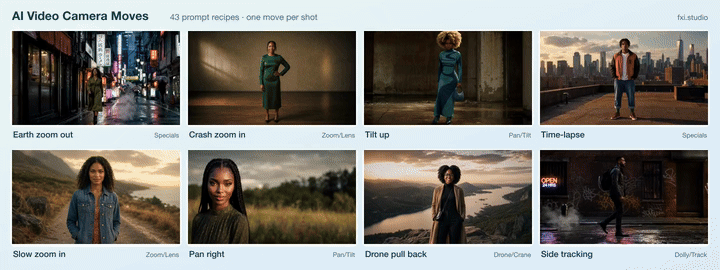

# AI Video Camera Movements: 43 prompt recipes with example clips

[](LICENSE)
[](LICENSE-DATA)
[](https://github.com/fueledximagination/fxi-camera-moves/actions/workflows/ci.yml)

**43 camera moves for AI video, each with a ready-to-paste prompt recipe, tips, negatives, a recommended clip length, and an example clip. Plain cinematography language that works with any text-to-video or image-to-video model. Free to use under CC BY 4.0.**

[](https://www.fxi.studio/tutorials/prompt-recipes?utm_source=github&utm_medium=oss&utm_campaign=camera-moves&utm_content=readme-top)

Eight of the 43 moves. See all of them at a glance on the **[contact sheet](docs/contact-sheet.jpg)**, or grab the [hero loop as MP4](docs/hero-grid.mp4).

> **Watch every move in motion.** Each recipe has its own page with the example clip playing, the exact prompt, and a one-click "Recreate" in FXI Studio. **[Browse all 43 Prompt Recipes →](https://www.fxi.studio/tutorials/prompt-recipes?utm_source=github&utm_medium=oss&utm_campaign=camera-moves&utm_content=readme-top)**

---

## What's in the dataset

| File | What it is |
|---|---|
| [`data/camera-moves.json`](data/camera-moves.json) | The source of truth: an array of 43 records. |
| [`data/camera-moves.csv`](data/camera-moves.csv) | The same records, one row each. `tips` and `negatives` are joined with ` \| `. |
| [`schema/camera-moves.schema.json`](schema/camera-moves.schema.json) | JSON Schema (2020-12) for the file. |
| [`huggingface/README.md`](huggingface/README.md) | Dataset card for the Hugging Face mirror. |

Each record:

| Field | Example | Notes |
|---|---|---|
| `id` | `dolly-in` | Stable kebab-case key. |
| `name` | `Dolly in` | |
| `category` | `Dolly/Track` | One of 7 categories (below). |
| `description` | `Camera body physically pushes forward toward the subject.` | One line. |
| `prompt` | `dolly in. Movement: … Speed: … Framing: … End: …` | The recipe. Paste it after your scene description. |
| `prompt_template` | `{scene}. Camera: dolly in. Movement: …` | Replace `{scene}` with your subject and setting. |
| `best_for` | `Intimacy with parallax …` | When to reach for it. |
| `tips` | `["Ask for visible parallax …", …]` | How to make the move land. |
| `negatives` | `["zoom", "pan", "tilt", …]` | Competing motions to rule out, for models with a negative prompt. |
| `recommended_duration_min_s` / `_max_s` | `5` / `8` | Clip length where the move reads best. |
| `dramatic` | `true` | Visually dynamic move. |
| `example_clip_url` / `example_clip_webm_url` | `https://assets.fxi.studio/…/dolly-in-v7.mp4` | 1280×720 example clip (MP4 / WebM). |
| `poster_url` | `https://assets.fxi.studio/…/dolly-in-v7.jpg` | Still frame from the clip. |
| `example_clip_duration_s`, `_width`, `_height` | `5.88`, `1280`, `720` | Example clip metadata. |
| `tutorial_url` | `https://www.fxi.studio/tutorials/prompt-recipes/dolly-in?…` | The recipe's page, with the clip playing. |

## Every recipe follows the same four-part shape

```
<move name>. Movement: <what the camera does and in which direction>.
Speed: <how fast, and whether it changes>.
Framing: <what stays level, centered, or fixed>.
End: <how the shot finishes>.
```

That structure is what makes the recipes portable. Models ignore camera direction mostly for three reasons: the prompt asks for two moves at once, it never says what must stay fixed, or it never says how the shot ends. Each recipe answers all three.

## How to use it with any image-to-video model

1. **Describe the shot first.** One or two sentences: subject, setting, light. No camera language yet.
2. **Append one recipe as its own sentence.** `"<your scene>. Camera: <prompt>"`, which is exactly `prompt_template` with `{scene}` filled in.
3. **Keep one move per shot.** Delete any other camera words from your prompt so the model commits to a single, readable move.
4. **Paste the negatives** into the negative prompt if your model has one. They rule out the motions each move is most often confused with (a dolly turning into a zoom, a truck turning into a pan).
5. **Set the clip length** inside `recommended_duration_min_s`–`recommended_duration_max_s`. Whip pans and crash zooms fall apart when stretched; orbits and drone moves need room.
6. **Pick a start frame with room to move.** For image-to-video, leave space in the direction of travel: open sky above a crane up, space on the right before a pan right.
7. **Check the last frame against the `End:` line.** If the move drifts, shorten the clip or restate what must stay fixed.

### Load it in code

JavaScript (Node 18+):

```js
const moves = await (await fetch(
  'https://raw.githubusercontent.com/fueledximagination/fxi-camera-moves/main/data/camera-moves.json'
)).json();

const move = moves.find((m) => m.id === 'dolly-in');
const prompt = move.prompt_template.replace('{scene}', 'A lighthouse keeper at a rain-streaked window at night');
const negative = move.negatives.join(', ');
```

Python:

```python
import json, urllib.request

url = "https://raw.githubusercontent.com/fueledximagination/fxi-camera-moves/main/data/camera-moves.json"
moves = {m["id"]: m for m in json.load(urllib.request.urlopen(url))}

move = moves["orbit-clockwise"]
prompt = move["prompt_template"].replace("{scene}", "A dancer in a red coat on an empty rooftop at dawn")
negative = ", ".join(move["negatives"])
```

pandas: `pd.read_csv("data/camera-moves.csv")`.

### Go longer than one generation: chain the moves

A single generation tops out at a few seconds. To build a longer continuous camera path (push in, then orbit, then crane up), generate each move as its own clip and start every clip on the **exact last frame of the previous one**. That is frame chaining, and [**fxi-frame-chain**](https://github.com/fueledximagination/fxi-frame-chain) is an open-source reference implementation (Node.js, works with a local ComfyUI). ComfyUI users can use [comfyui-fxi-frame-chain](https://github.com/fueledximagination/comfyui-fxi-frame-chain).

## All 43 camera moves

Click any frame to watch the clip and copy the recipe. Want the overview in one image? See the [contact sheet of all 43 moves](docs/contact-sheet.jpg).

<!-- camera-moves:start (generated by scripts/build.js, do not edit by hand) -->
[Pan/Tilt](#pantilt) (7) · [Zoom/Lens](#zoomlens) (6) · [Dolly/Track](#dollytrack) (7) · [Physical Moves](#physical-moves) (10) · [Human Camera](#human-camera) (3) · [Drone/Crane](#dronecrane) (5) · [Specials](#specials) (5)

### Pan/Tilt

| Example | Move | Recipe | Length |
|---|---|---|---|
| <a href="https://www.fxi.studio/tutorials/prompt-recipes/static-shot?utm_source=github&utm_medium=oss&utm_campaign=camera-moves&utm_content=readme-table"></a> | **[Static shot](https://www.fxi.studio/tutorials/prompt-recipes/static-shot?utm_source=github&utm_medium=oss&utm_campaign=camera-moves&utm_content=readme-table)**<br><sub>Locked-off frame — no camera movement at all.</sub> | locked-off static shot. Movement: hold one fixed camera position for the full clip. Speed: still and steady. Framing: keep the same angle, height, lens distance and composition. End: finish with the same framing and camera position. | 4–6s |
| <a href="https://www.fxi.studio/tutorials/prompt-recipes/pan-right?utm_source=github&utm_medium=oss&utm_campaign=camera-moves&utm_content=readme-table"></a> | **[Pan right](https://www.fxi.studio/tutorials/prompt-recipes/pan-right?utm_source=github&utm_medium=oss&utm_campaign=camera-moves&utm_content=readme-table)**<br><sub>Horizontal rotation left-to-right from a fixed point.</sub> | pan right. Movement: rotate the camera horizontally from left to right from one fixed point. Speed: smooth constant rotation. Framing: keep the horizon level while new space enters from the right side of the frame. End: settle on a clear final composition. | 4–6s |
| <a href="https://www.fxi.studio/tutorials/prompt-recipes/pan-left?utm_source=github&utm_medium=oss&utm_campaign=camera-moves&utm_content=readme-table"></a> | **[Pan left](https://www.fxi.studio/tutorials/prompt-recipes/pan-left?utm_source=github&utm_medium=oss&utm_campaign=camera-moves&utm_content=readme-table)**<br><sub>Horizontal rotation right-to-left from a fixed point.</sub> | pan left. Movement: rotate the camera horizontally from right to left from one fixed point. Speed: smooth constant rotation. Framing: keep the horizon level while new space enters from the left side of the frame. End: settle on a clear final composition. | 4–6s |
| <a href="https://www.fxi.studio/tutorials/prompt-recipes/whip-pan-right?utm_source=github&utm_medium=oss&utm_campaign=camera-moves&utm_content=readme-table"></a> | **[Whip pan right](https://www.fxi.studio/tutorials/prompt-recipes/whip-pan-right?utm_source=github&utm_medium=oss&utm_campaign=camera-moves&utm_content=readme-table)**<br><sub>Fast snap rotation to the right with motion blur.</sub> | whip pan right. Movement: rotate rapidly from the starting direction toward a new target on the right. Speed: fast snap with brief motion blur during the rotation. Framing: begin on one readable composition and land on a second readable target. End: settle into a sharp final frame. | 2–4s |
| <a href="https://www.fxi.studio/tutorials/prompt-recipes/whip-pan-left?utm_source=github&utm_medium=oss&utm_campaign=camera-moves&utm_content=readme-table"></a> | **[Whip pan left](https://www.fxi.studio/tutorials/prompt-recipes/whip-pan-left?utm_source=github&utm_medium=oss&utm_campaign=camera-moves&utm_content=readme-table)**<br><sub>Fast snap rotation to the left with motion blur.</sub> | whip pan left. Movement: rotate rapidly from the starting direction toward a new target on the left. Speed: fast snap with brief motion blur during the rotation. Framing: begin on one readable composition and land on a second readable target. End: settle into a sharp final frame. | 2–4s |
| <a href="https://www.fxi.studio/tutorials/prompt-recipes/tilt-up?utm_source=github&utm_medium=oss&utm_campaign=camera-moves&utm_content=readme-table"></a> | **[Tilt up](https://www.fxi.studio/tutorials/prompt-recipes/tilt-up?utm_source=github&utm_medium=oss&utm_campaign=camera-moves&utm_content=readme-table)**<br><sub>Vertical rotation upward from a fixed point.</sub> | tilt up. Movement: rotate the camera upward from one fixed point. Speed: smooth constant tilt. Framing: keep the vertical subject or architecture centered as the frame travels upward. End: land on the upper target. | 4–6s |
| <a href="https://www.fxi.studio/tutorials/prompt-recipes/tilt-down?utm_source=github&utm_medium=oss&utm_campaign=camera-moves&utm_content=readme-table"></a> | **[Tilt down](https://www.fxi.studio/tutorials/prompt-recipes/tilt-down?utm_source=github&utm_medium=oss&utm_campaign=camera-moves&utm_content=readme-table)**<br><sub>Vertical rotation downward from a fixed point.</sub> | tilt down. Movement: rotate the camera downward from one fixed point. Speed: smooth constant tilt. Framing: keep the vertical subject or architecture centered as the frame travels downward. End: land on the lower target. | 4–6s |

### Zoom/Lens

| Example | Move | Recipe | Length |
|---|---|---|---|
| <a href="https://www.fxi.studio/tutorials/prompt-recipes/slow-zoom-in?utm_source=github&utm_medium=oss&utm_campaign=camera-moves&utm_content=readme-table"></a> | **[Slow zoom in](https://www.fxi.studio/tutorials/prompt-recipes/slow-zoom-in?utm_source=github&utm_medium=oss&utm_campaign=camera-moves&utm_content=readme-table)**<br><sub>Gradual optical push toward a tighter frame.</sub> | slow zoom in. Movement: slowly increase lens focal length toward a tighter frame. Speed: gradual and even. Framing: keep the main visual target readable as it becomes larger in frame. End: finish on a stable tighter composition. | 5–8s |
| <a href="https://www.fxi.studio/tutorials/prompt-recipes/slow-zoom-out?utm_source=github&utm_medium=oss&utm_campaign=camera-moves&utm_content=readme-table"></a> | **[Slow zoom out](https://www.fxi.studio/tutorials/prompt-recipes/slow-zoom-out?utm_source=github&utm_medium=oss&utm_campaign=camera-moves&utm_content=readme-table)**<br><sub>Gradual optical pull toward a wider frame.</sub> | slow zoom out. Movement: slowly decrease lens focal length toward a wider frame. Speed: gradual and even. Framing: keep the main visual target readable as more surrounding space appears. End: finish on a stable wider composition. | 5–8s |
| <a href="https://www.fxi.studio/tutorials/prompt-recipes/fast-zoom-in?utm_source=github&utm_medium=oss&utm_campaign=camera-moves&utm_content=readme-table"></a> | **[Fast zoom in](https://www.fxi.studio/tutorials/prompt-recipes/fast-zoom-in?utm_source=github&utm_medium=oss&utm_campaign=camera-moves&utm_content=readme-table)**<br><sub>Quick decisive optical push to a tighter frame.</sub> | fast zoom in. Movement: quickly increase lens focal length toward the main visual target. Speed: quick decisive zoom. Framing: keep the target centered or clearly readable during the scale change. End: finish on a stable tighter composition. | 3–5s |
| <a href="https://www.fxi.studio/tutorials/prompt-recipes/fast-zoom-out?utm_source=github&utm_medium=oss&utm_campaign=camera-moves&utm_content=readme-table"></a> | **[Fast zoom out](https://www.fxi.studio/tutorials/prompt-recipes/fast-zoom-out?utm_source=github&utm_medium=oss&utm_campaign=camera-moves&utm_content=readme-table)**<br><sub>Quick decisive optical pull to a wider frame.</sub> | fast zoom out. Movement: quickly decrease lens focal length away from the main visual target. Speed: quick decisive zoom. Framing: keep the target readable as the surrounding space appears. End: finish on a stable wider composition. | 3–5s |
| <a href="https://www.fxi.studio/tutorials/prompt-recipes/crash-zoom-in?utm_source=github&utm_medium=oss&utm_campaign=camera-moves&utm_content=readme-table"></a> | **[Crash zoom in](https://www.fxi.studio/tutorials/prompt-recipes/crash-zoom-in?utm_source=github&utm_medium=oss&utm_campaign=camera-moves&utm_content=readme-table)**<br><sub>Violent snap zoom toward the target.</sub> | crash zoom in. Movement: snap the lens rapidly toward the main visual target. Speed: very fast and punchy. Framing: keep the target readable through the sudden scale change. End: land on a bold tighter composition. | 2–3s |
| <a href="https://www.fxi.studio/tutorials/prompt-recipes/crash-zoom-out?utm_source=github&utm_medium=oss&utm_campaign=camera-moves&utm_content=readme-table"></a> | **[Crash zoom out](https://www.fxi.studio/tutorials/prompt-recipes/crash-zoom-out?utm_source=github&utm_medium=oss&utm_campaign=camera-moves&utm_content=readme-table)**<br><sub>Violent snap zoom away from the target.</sub> | crash zoom out. Movement: snap the lens rapidly away from the main visual target. Speed: very fast and punchy. Framing: keep the target readable as the surrounding space appears. End: land on a bold wider composition. | 2–3s |

### Dolly/Track

| Example | Move | Recipe | Length |
|---|---|---|---|
| <a href="https://www.fxi.studio/tutorials/prompt-recipes/dolly-in?utm_source=github&utm_medium=oss&utm_campaign=camera-moves&utm_content=readme-table"></a> | **[Dolly in](https://www.fxi.studio/tutorials/prompt-recipes/dolly-in?utm_source=github&utm_medium=oss&utm_campaign=camera-moves&utm_content=readme-table)**<br><sub>Camera body physically pushes forward toward the subject.</sub> | dolly in. Movement: move the camera physically forward in a straight line toward the main subject. Speed: smooth controlled push. Framing: keep camera height, lens direction and subject position consistent while distance closes. End: finish in a tighter composition. | 5–8s |
| <a href="https://www.fxi.studio/tutorials/prompt-recipes/dolly-out?utm_source=github&utm_medium=oss&utm_campaign=camera-moves&utm_content=readme-table"></a> | **[Dolly out](https://www.fxi.studio/tutorials/prompt-recipes/dolly-out?utm_source=github&utm_medium=oss&utm_campaign=camera-moves&utm_content=readme-table)**<br><sub>Camera body physically retreats from the subject.</sub> | dolly out. Movement: move the camera physically backward in a straight line away from the main subject. Speed: smooth controlled retreat. Framing: keep lens direction and camera height consistent while more environment enters frame. End: finish in a wider composition. | 5–8s |
| <a href="https://www.fxi.studio/tutorials/prompt-recipes/tracking-shot?utm_source=github&utm_medium=oss&utm_campaign=camera-moves&utm_content=readme-table"></a> | **[Tracking shot](https://www.fxi.studio/tutorials/prompt-recipes/tracking-shot?utm_source=github&utm_medium=oss&utm_campaign=camera-moves&utm_content=readme-table)**<br><sub>Camera travels through the scene with the subject.</sub> | tracking shot. Movement: move through the scene with the main subject. Speed: match the subject pace. Framing: keep the subject consistently readable while the environment moves around them. End: maintain a clear moving composition. | 5–8s |
| <a href="https://www.fxi.studio/tutorials/prompt-recipes/follow-ots?utm_source=github&utm_medium=oss&utm_campaign=camera-moves&utm_content=readme-table"></a> | **[Follow shot / over-the-shoulder](https://www.fxi.studio/tutorials/prompt-recipes/follow-ots?utm_source=github&utm_medium=oss&utm_campaign=camera-moves&utm_content=readme-table)**<br><sub>Camera trails behind the subject at shoulder height.</sub> | follow shot from behind. Movement: move behind the subject along their route at shoulder height. Speed: match the subject pace. Framing: keep the back, shoulder or head as the foreground guide while the route ahead stays readable. End: continue following with the subject leading the frame. | 5–8s |
| <a href="https://www.fxi.studio/tutorials/prompt-recipes/reverse-tracking?utm_source=github&utm_medium=oss&utm_campaign=camera-moves&utm_content=readme-table"></a> | **[Reverse tracking / walk-and-talk](https://www.fxi.studio/tutorials/prompt-recipes/reverse-tracking?utm_source=github&utm_medium=oss&utm_campaign=camera-moves&utm_content=readme-table)**<br><sub>Camera moves backward in front of a walking subject.</sub> | reverse tracking shot. Movement: move backward in front of the walking subject. Speed: match the subject forward pace. Framing: keep front-facing face and body framing stable as the background moves behind them. End: hold a clear front-facing moving composition. | 5–8s |
| <a href="https://www.fxi.studio/tutorials/prompt-recipes/side-tracking?utm_source=github&utm_medium=oss&utm_campaign=camera-moves&utm_content=readme-table"></a> | **[Side tracking](https://www.fxi.studio/tutorials/prompt-recipes/side-tracking?utm_source=github&utm_medium=oss&utm_campaign=camera-moves&utm_content=readme-table)**<br><sub>Camera glides parallel beside the subject.</sub> | side tracking shot. Movement: move parallel beside the subject along their direction of travel. Speed: match the subject motion. Framing: keep the subject in side profile or three-quarter profile at a stable distance. End: continue the parallel movement with clear horizontal motion. | 5–8s |
| <a href="https://www.fxi.studio/tutorials/prompt-recipes/low-tracking?utm_source=github&utm_medium=oss&utm_campaign=camera-moves&utm_content=readme-table"></a> | **[Low tracking](https://www.fxi.studio/tutorials/prompt-recipes/low-tracking?utm_source=github&utm_medium=oss&utm_campaign=camera-moves&utm_content=readme-table)**<br><sub>Ground-level travel alongside the subject.</sub> | low tracking shot. Movement: move at ground or below-waist height alongside the subject movement path. Speed: match the subject, footsteps or wheels. Framing: keep the low detail readable while the ground plane moves through frame. End: finish with the low perspective clearly maintained. | 4–7s |

### Physical Moves

| Example | Move | Recipe | Length |
|---|---|---|---|
| <a href="https://www.fxi.studio/tutorials/prompt-recipes/truck-left?utm_source=github&utm_medium=oss&utm_campaign=camera-moves&utm_content=readme-table"></a> | **[Truck left](https://www.fxi.studio/tutorials/prompt-recipes/truck-left?utm_source=github&utm_medium=oss&utm_campaign=camera-moves&utm_content=readme-table)**<br><sub>Whole camera slides left on a horizontal path.</sub> | truck left. Movement: move the camera physically to the left on a straight horizontal path. Speed: smooth constant lateral travel. Framing: keep the lens facing the same direction while the scene slides across frame. End: finish on a clean lateral composition. | 4–6s |
| <a href="https://www.fxi.studio/tutorials/prompt-recipes/truck-right?utm_source=github&utm_medium=oss&utm_campaign=camera-moves&utm_content=readme-table"></a> | **[Truck right](https://www.fxi.studio/tutorials/prompt-recipes/truck-right?utm_source=github&utm_medium=oss&utm_campaign=camera-moves&utm_content=readme-table)**<br><sub>Whole camera slides right on a horizontal path.</sub> | truck right. Movement: move the camera physically to the right on a straight horizontal path. Speed: smooth constant lateral travel. Framing: keep the lens facing the same direction while the scene slides across frame. End: finish on a clean lateral composition. | 4–6s |
| <a href="https://www.fxi.studio/tutorials/prompt-recipes/pedestal-up?utm_source=github&utm_medium=oss&utm_campaign=camera-moves&utm_content=readme-table"></a> | **[Pedestal up](https://www.fxi.studio/tutorials/prompt-recipes/pedestal-up?utm_source=github&utm_medium=oss&utm_campaign=camera-moves&utm_content=readme-table)**<br><sub>Whole camera rises straight up, lens kept level.</sub> | pedestal up. Movement: move the entire camera vertically upward in a straight line. Speed: smooth constant lift. Framing: keep the lens level and pointed in the same direction during the vertical move. End: finish with the higher framing clearly readable. | 4–6s |
| <a href="https://www.fxi.studio/tutorials/prompt-recipes/pedestal-down?utm_source=github&utm_medium=oss&utm_campaign=camera-moves&utm_content=readme-table"></a> | **[Pedestal down](https://www.fxi.studio/tutorials/prompt-recipes/pedestal-down?utm_source=github&utm_medium=oss&utm_campaign=camera-moves&utm_content=readme-table)**<br><sub>Whole camera lowers straight down, lens kept level.</sub> | pedestal down. Movement: move the entire camera vertically downward in a straight line. Speed: smooth constant descent. Framing: keep the lens level and pointed in the same direction during the vertical move. End: finish with the lower framing clearly readable. | 4–6s |
| <a href="https://www.fxi.studio/tutorials/prompt-recipes/arc-left?utm_source=github&utm_medium=oss&utm_campaign=camera-moves&utm_content=readme-table"></a> | **[Arc left](https://www.fxi.studio/tutorials/prompt-recipes/arc-left?utm_source=github&utm_medium=oss&utm_campaign=camera-moves&utm_content=readme-table)**<br><sub>Shallow curved move around the subject to the left.</sub> | arc left. Movement: move on a shallow curved path around the main subject toward the left side. Speed: smooth measured curve. Framing: keep distance, height and subject readability consistent while the angle changes. End: finish from a new left-side angle. | 5–8s |
| <a href="https://www.fxi.studio/tutorials/prompt-recipes/arc-right?utm_source=github&utm_medium=oss&utm_campaign=camera-moves&utm_content=readme-table"></a> | **[Arc right](https://www.fxi.studio/tutorials/prompt-recipes/arc-right?utm_source=github&utm_medium=oss&utm_campaign=camera-moves&utm_content=readme-table)**<br><sub>Shallow curved move around the subject to the right.</sub> | arc right. Movement: move on a shallow curved path around the main subject toward the right side. Speed: smooth measured curve. Framing: keep distance, height and subject readability consistent while the angle changes. End: finish from a new right-side angle. | 5–8s |
| <a href="https://www.fxi.studio/tutorials/prompt-recipes/orbit-clockwise?utm_source=github&utm_medium=oss&utm_campaign=camera-moves&utm_content=readme-table"></a> | **[Orbit clockwise](https://www.fxi.studio/tutorials/prompt-recipes/orbit-clockwise?utm_source=github&utm_medium=oss&utm_campaign=camera-moves&utm_content=readme-table)**<br><sub>Full circle around the subject, clockwise.</sub> | clockwise orbit. Movement: circle clockwise around the main subject at a consistent radius. Speed: smooth controlled orbit. Framing: keep the subject centered while the background rotates around them. End: complete the intended arc or full circle with stable framing. | 6–10s |
| <a href="https://www.fxi.studio/tutorials/prompt-recipes/orbit-counterclockwise?utm_source=github&utm_medium=oss&utm_campaign=camera-moves&utm_content=readme-table"></a> | **[Orbit counterclockwise](https://www.fxi.studio/tutorials/prompt-recipes/orbit-counterclockwise?utm_source=github&utm_medium=oss&utm_campaign=camera-moves&utm_content=readme-table)**<br><sub>Full circle around the subject, counterclockwise.</sub> | counterclockwise orbit. Movement: circle counterclockwise around the main subject at a consistent radius. Speed: smooth controlled orbit. Framing: keep the subject centered while the background rotates around them. End: complete the intended arc or full circle with stable framing. | 6–10s |
| <a href="https://www.fxi.studio/tutorials/prompt-recipes/push-past?utm_source=github&utm_medium=oss&utm_campaign=camera-moves&utm_content=readme-table"></a> | **[Push past / pass-by shot](https://www.fxi.studio/tutorials/prompt-recipes/push-past?utm_source=github&utm_medium=oss&utm_campaign=camera-moves&utm_content=readme-table)**<br><sub>Glide forward past a foreground object into the space beyond.</sub> | push past. Movement: move forward past a visible foreground object, edge or opening. Speed: smooth forward glide. Framing: let the foreground pass close to the lens while the space beyond becomes clearer. End: arrive inside or beyond the foreground layer. | 4–7s |
| <a href="https://www.fxi.studio/tutorials/prompt-recipes/pass-through?utm_source=github&utm_medium=oss&utm_campaign=camera-moves&utm_content=readme-table"></a> | **[Pass-through objects](https://www.fxi.studio/tutorials/prompt-recipes/pass-through?utm_source=github&utm_medium=oss&utm_campaign=camera-moves&utm_content=readme-table)**<br><sub>Move toward and continue through a surface or barrier.</sub> | pass-through movement. Movement: move forward toward a visible object, surface or barrier and continue into the space beyond. Speed: smooth centered glide. Framing: keep the opening or surface centered as the transition point. End: arrive inside the revealed space beyond. | 4–7s |

### Human Camera

| Example | Move | Recipe | Length |
|---|---|---|---|
| <a href="https://www.fxi.studio/tutorials/prompt-recipes/handheld-shot?utm_source=github&utm_medium=oss&utm_campaign=camera-moves&utm_content=readme-table"></a> | **[Handheld shot](https://www.fxi.studio/tutorials/prompt-recipes/handheld-shot?utm_source=github&utm_medium=oss&utm_campaign=camera-moves&utm_content=readme-table)**<br><sub>Operator-height frame with natural organic sway.</sub> | handheld shot. Movement: hold the camera at human operator height with natural body movement. Speed: responsive and organic. Framing: keep the subject readable while the frame has subtle sway and micro-adjustments. End: finish with a natural handheld composition. | 4–8s |
| <a href="https://www.fxi.studio/tutorials/prompt-recipes/chase-shot?utm_source=github&utm_medium=oss&utm_campaign=camera-moves&utm_content=readme-table"></a> | **[Chase shot](https://www.fxi.studio/tutorials/prompt-recipes/chase-shot?utm_source=github&utm_medium=oss&utm_campaign=camera-moves&utm_content=readme-table)**<br><sub>Fast reactive pursuit of a moving subject.</sub> | chase shot. Movement: follow a moving subject quickly along the action route. Speed: fast, reactive and physically close. Framing: keep the subject visible while allowing energetic reframing. End: stay connected to the subject in motion. | 4–6s |
| <a href="https://www.fxi.studio/tutorials/prompt-recipes/snorricam?utm_source=github&utm_medium=oss&utm_campaign=camera-moves&utm_content=readme-table"></a> | **[Body-mounted camera / Snorricam](https://www.fxi.studio/tutorials/prompt-recipes/snorricam?utm_source=github&utm_medium=oss&utm_campaign=camera-moves&utm_content=readme-table)**<br><sub>Camera fixed to the subject; the world moves around them.</sub> | body-mounted Snorricam. Movement: keep the camera fixed relative to the subject torso or face while the subject moves. Speed: match the subject body motion. Framing: keep the subject close, centered and facing the camera as the background moves around them. End: finish with the subject still locked in frame. | 4–6s |

### Drone/Crane

| Example | Move | Recipe | Length |
|---|---|---|---|
| <a href="https://www.fxi.studio/tutorials/prompt-recipes/crane-up?utm_source=github&utm_medium=oss&utm_campaign=camera-moves&utm_content=readme-table"></a> | **[Crane up](https://www.fxi.studio/tutorials/prompt-recipes/crane-up?utm_source=github&utm_medium=oss&utm_campaign=camera-moves&utm_content=readme-table)**<br><sub>Smooth vertical lift through open space.</sub> | crane up. Movement: travel smoothly upward through open space. Speed: slow controlled vertical lift. Framing: keep the subject or location readable as the camera rises. End: finish with the higher scale clearly visible. | 5–8s |
| <a href="https://www.fxi.studio/tutorials/prompt-recipes/crane-down?utm_source=github&utm_medium=oss&utm_campaign=camera-moves&utm_content=readme-table"></a> | **[Crane down](https://www.fxi.studio/tutorials/prompt-recipes/crane-down?utm_source=github&utm_medium=oss&utm_campaign=camera-moves&utm_content=readme-table)**<br><sub>Smooth vertical descent through open space.</sub> | crane down. Movement: travel smoothly downward through open space. Speed: slow controlled vertical descent. Framing: keep the subject or location readable as the camera descends. End: finish with the lower subject or destination clearly visible. | 5–8s |
| <a href="https://www.fxi.studio/tutorials/prompt-recipes/drone-push-in?utm_source=github&utm_medium=oss&utm_campaign=camera-moves&utm_content=readme-table"></a> | **[Drone push in](https://www.fxi.studio/tutorials/prompt-recipes/drone-push-in?utm_source=github&utm_medium=oss&utm_campaign=camera-moves&utm_content=readme-table)**<br><sub>Aerial forward glide toward the subject.</sub> | drone push in. Movement: fly smoothly forward through open space toward the subject or destination. Speed: controlled aerial glide. Framing: keep the route and destination readable as the camera approaches. End: arrive at a closer aerial composition. | 6–10s |
| <a href="https://www.fxi.studio/tutorials/prompt-recipes/drone-pull-back?utm_source=github&utm_medium=oss&utm_campaign=camera-moves&utm_content=readme-table"></a> | **[Drone pull back](https://www.fxi.studio/tutorials/prompt-recipes/drone-pull-back?utm_source=github&utm_medium=oss&utm_campaign=camera-moves&utm_content=readme-table)**<br><sub>Aerial backward glide revealing more landscape.</sub> | drone pull back. Movement: fly smoothly backward away from the subject or destination. Speed: controlled aerial retreat. Framing: keep the subject readable as more landscape appears. End: finish on a wider aerial composition. | 6–10s |
| <a href="https://www.fxi.studio/tutorials/prompt-recipes/helicopter-shot?utm_source=github&utm_medium=oss&utm_campaign=camera-moves&utm_content=readme-table"></a> | **[Helicopter shot](https://www.fxi.studio/tutorials/prompt-recipes/helicopter-shot?utm_source=github&utm_medium=oss&utm_campaign=camera-moves&utm_content=readme-table)**<br><sub>High-altitude broad flight path over a landscape.</sub> | helicopter-style aerial shot. Movement: move from high altitude along a broad gradual flight path. Speed: steady controlled aerial motion. Framing: keep the landscape or distant moving subject readable at wide scale. End: finish on a stable high-altitude composition. | 6–10s |

### Specials

| Example | Move | Recipe | Length |
|---|---|---|---|
| <a href="https://www.fxi.studio/tutorials/prompt-recipes/first-person-view?utm_source=github&utm_medium=oss&utm_campaign=camera-moves&utm_content=readme-table"></a> | **[First-person view](https://www.fxi.studio/tutorials/prompt-recipes/first-person-view?utm_source=github&utm_medium=oss&utm_campaign=camera-moves&utm_content=readme-table)**<br><sub>POV from the character own eyes, with visible body.</sub> | first-person view. Movement: move forward at human eye height from the character perspective. Speed: natural walking or reaching pace. Framing: use visible hands, arms or body edges as the viewer physical reference. End: arrive at the next point of action from the same point of view. | 4–8s |
| <a href="https://www.fxi.studio/tutorials/prompt-recipes/tilt-shift?utm_source=github&utm_medium=oss&utm_campaign=camera-moves&utm_content=readme-table"></a> | **[Tilt-shift](https://www.fxi.studio/tutorials/prompt-recipes/tilt-shift?utm_source=github&utm_medium=oss&utm_campaign=camera-moves&utm_content=readme-table)**<br><sub>Miniature-look with a narrow band of sharp focus.</sub> | tilt-shift miniature view. Movement: hold or glide from a high angled view over the scene. Speed: small precise movement. Framing: keep a narrow band of sharp focus across the key subject area with soft blur above and below. End: finish with the miniature-scale view intact. | 4–8s |
| <a href="https://www.fxi.studio/tutorials/prompt-recipes/infinite-zoom?utm_source=github&utm_medium=oss&utm_campaign=camera-moves&utm_content=readme-table"></a> | **[Infinite zoom](https://www.fxi.studio/tutorials/prompt-recipes/infinite-zoom?utm_source=github&utm_medium=oss&utm_campaign=camera-moves&utm_content=readme-table)**<br><sub>Continuous accelerating zoom into the center.</sub> | infinite zoom. Movement: zoom continuously inward toward the exact center target. Speed: smooth accelerating zoom. Framing: keep the circular target centered as it expands. End: finish when the next visual world fills the frame. | 6–10s |
| <a href="https://www.fxi.studio/tutorials/prompt-recipes/earth-zoom-out?utm_source=github&utm_medium=oss&utm_campaign=camera-moves&utm_content=readme-table"></a> | **[Earth zoom out](https://www.fxi.studio/tutorials/prompt-recipes/earth-zoom-out?utm_source=github&utm_medium=oss&utm_campaign=camera-moves&utm_content=readme-table)**<br><sub>Rapid pull from street to planet scale.</sub> | earth zoom out. Movement: pull upward from the starting point through street, city, landscape and planet scale. Speed: rapid expanding zoom out. Framing: keep the original location centered as scale grows. End: finish on a planet-scale view with the starting point still implied at center. | 6–10s |
| <a href="https://www.fxi.studio/tutorials/prompt-recipes/time-lapse?utm_source=github&utm_medium=oss&utm_campaign=camera-moves&utm_content=readme-table"></a> | **[Time-lapse](https://www.fxi.studio/tutorials/prompt-recipes/time-lapse?utm_source=github&utm_medium=oss&utm_campaign=camera-moves&utm_content=readme-table)**<br><sub>Fixed camera while time races forward.</sub> | locked-camera time-lapse. Movement: hold one fixed camera position while time moves rapidly forward. Speed: fast time compression with a stable camera. Framing: keep the same composition and horizon as motion passes through the frame. End: finish from the same camera angle with visible passage of time. | 5–10s |
<!-- camera-moves:end -->

## Frequently asked questions

**What camera movements work best for AI video?**
Simple, single-axis moves are the most reliable: a slow dolly in, a pan, a tilt, a crane up, or a locked-off static shot. Complex moves such as orbits and arcs work when you name the direction and the arc length and rule out competing motion like zooms or height changes.

**How do I prompt a dolly zoom (the vertigo effect)?**
Combine two opposite moves: the camera travels toward the subject while the lens zooms out, so the subject stays the same size and the background stretches. Start from the `dolly-in` and `slow-zoom-out` recipes and merge their Movement lines: "dolly in toward the subject while zooming out at the same rate; the subject stays the same size in frame while the background appears to stretch away."

**Why does the AI ignore my camera movement?**
Usually because the prompt asks for two moves at once, or never says how the shot ends. Name one move, say what must not change, and describe the final frame.

**Can I use these with any model?**
Yes. The recipes are plain cinematography language, not model-specific syntax.

## Contributing

Corrections and new moves are welcome; see [CONTRIBUTING.md](CONTRIBUTING.md). Edit `data/camera-moves.json`, then run `npm run build` (regenerates the CSV and the table above) and `npm test`. No dependencies to install.

## License and citation

- **Data** (`data/`, `schema/`, and the recipe text in this README): [CC BY 4.0](LICENSE-DATA). Use it anywhere, including commercially, with attribution: *"Camera movement recipes by FXI Studio (fxi.studio), CC BY 4.0"* and a link to this repository.
- **Code** (`src/`, `scripts/`, `test/`): [MIT](LICENSE).
- **Example clips and poster frames** are linked, not bundled. They were made with FXI Studio and remain © FUELED BY IMAGINATION, LLC, all rights reserved; neither license above covers them. Link to them; don't re-host them.
- "FXI" and "FXI Studio" are trademarks of FUELED BY IMAGINATION, LLC and are not licensed under either license.

If you use the dataset in research or a product, please cite it:

```bibtex
@misc{fxi_camera_moves_2026,
  title        = {AI Video Camera Movements: 43 prompt recipes with example clips},
  author       = {{FUELED BY IMAGINATION, LLC}},
  year         = {2026},
  howpublished = {\url{https://github.com/fueledximagination/fxi-camera-moves}},
  note         = {Dataset, CC BY 4.0. FXI Studio, https://www.fxi.studio}
}
```

A [`CITATION.cff`](CITATION.cff) is included, so GitHub's "Cite this repository" button works too.

---

> **Want the moves without the prompt wrangling?** In FXI Studio, every recipe is one click from a generation, and moves chain into continuous shots automatically. **[Open the Prompt Recipes →](https://www.fxi.studio/tutorials/prompt-recipes?utm_source=github&utm_medium=oss&utm_campaign=camera-moves&utm_content=readme-bottom)**
